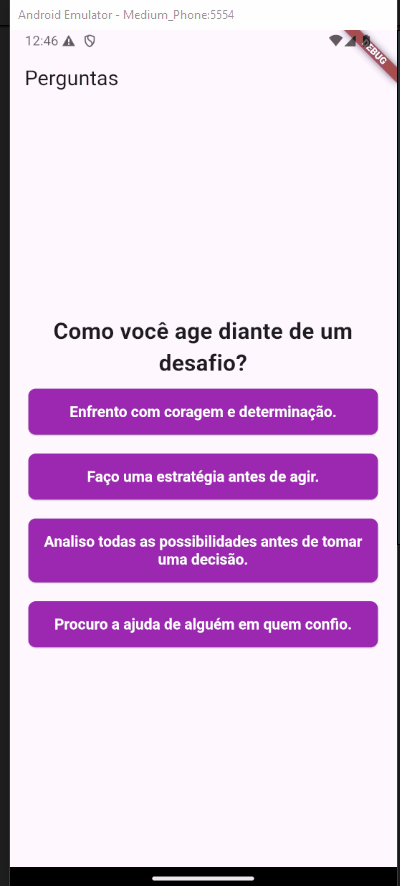

# Questionário das casas de Hogwarts

Projeto para estudar flutter


Verison: 3.24.2

## Project Question





## Como utilizar o projeto

### Clonar o repositório

```bash
  git clone git@github.com:andreyna1808/flutter_projects.git
```

Ou...

```bash
  git clone https://github.com/andreyna1808/flutter_projects.git
```

Entre na pasta do questions

```bash
  cd questions
```

## Rodar o projeto no VSCODE

### Instale as dependências

```bash
  flutter pub get
```

### Selecione o Emulador

Control + Shift + P > Select Device

### Rode o projeto

Control + Shift + P > Start Debugging or F5

## Rodar o projeto no Android Studio

Abra a pasta de *questions* no Android Studio

Selecione o Emulador

Aperte no play

## Tecnologias utilizadas

[](https://skillicons.dev)

## Email para contato: andreyna.m.carvalho@gmail.com

### Desenvolvido por Andreyna Carvalho 🤗

[<br><sub>Andreyna Carvalho</sub>](https://github.com/andreyna1808)

## Getting Started

This project is a starting point for a Flutter application.

A few resources to get you started if this is your first Flutter project:

- [Lab: Write your first Flutter app](https://docs.flutter.dev/get-started/codelab)
- [Cookbook: Useful Flutter samples](https://docs.flutter.dev/cookbook)

For help getting started with Flutter development, view the
[online documentation](https://docs.flutter.dev/), which offers tutorials,
samples, guidance on mobile development, and a full API reference.
